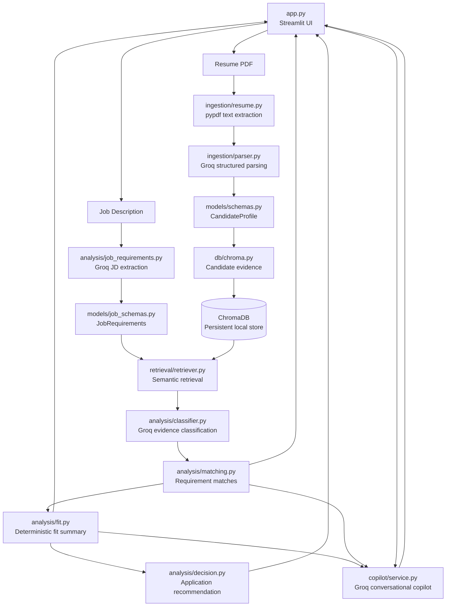

# JobPilot

JobPilot is an evidence-grounded conversational job application copilot built as an **LLM Zoomcamp final project**.

It combines a candidate's resume with a specific job description, extracts structured requirements, retrieves the candidate's actual resume evidence, classifies evidence support, calculates a deterministic job-fit summary, and provides conversational guidance through a Streamlit interface.

**Job Analyzer asks:**

`Job Description -> Analysis`

**JobPilot asks:**

`Job Description + Candidate Resume -> Requirements -> Evidence Retrieval -> Evidence Matching -> Job Fit -> Conversational Guidance`

---

## Demo


```powershell
streamlit run app.py
```

From the interface, a user:

1. Uploads a resume PDF.
2. Pastes a job description.
3. Selects **Analyze Job**.
4. Reviews the requirement matches, fit summary, and application recommendation.
5. Uses the conversational copilot to ask questions such as:

   * **Should I apply?**
   * **What should I improve?**
   * **What should I learn?**

---

## Problem

Candidates often have both a resume and a job description but still need to work out:

* Should I apply?
* How well does my existing experience match this job?
* What should I improve in my resume?
* What should I learn next?

JobPilot addresses these questions by grounding the analysis in evidence extracted from the candidate's resume.

Instead of treating semantic similarity as proof of a qualification, the system distinguishes between:

* **strong evidence**
* **partial evidence**
* **no evidence**

This allows the application to provide more conservative, evidence-grounded job-fit guidance.

---

# How It Works

1. The user uploads a Resume PDF.
2. `ingestion.resume.extract_text()` extracts text using `pypdf`.
3. `ingestion.parser.parse_resume_text()` sends the resume text to Groq structured output and validates a `CandidateProfile` with Pydantic.
4. `db.chroma.add_candidate_evidence()` stores candidate skills and factual experience/project evidence in ChromaDB.
5. The user provides a Job Description in the Streamlit text area.
6. `analysis.job_requirements.extract_job_requirements()` extracts structured `JobRequirements` using Groq structured output and Pydantic.
7. Each candidate-matchable requirement is used as a query by `retrieval.retriever.retrieve_evidence()`.
8. Retrieved evidence is classified by `analysis.classifier` as `strong`, `partial`, or `no_evidence`.
9. The results become `RequirementMatch` records inside `JobMatch`.
10. `analysis.fit.calculate_fit()` aggregates the matches into a deterministic fit summary.
11. `analysis.decision.should_apply()` generates the application recommendation.
12. The existing analysis is passed to `copilot.service.JobPilotCopilot`.
13. The user can ask follow-up questions in the Streamlit chat.

The conversational layer does **not** re-run the full resume/JD analysis pipeline for every question. It uses the existing analysis and recent conversation history.

JD requirements categorized as `application` or `other` are marked `not_applicable` by the retrieval matcher. They are retained as job information but are not treated as candidate capability evidence.

---

# Architecture

The complete architecture is documented in:

`docs/architecture.md`

At a high level:



The application entry point is `app.py`. It coordinates the Streamlit interaction while the domain logic remains separated under `src/`.

---

# LLM Architecture

JobPilot currently uses:

```text
openai/gpt-oss-20b
```

as the default Groq model across the LLM-powered components.

The model is used for:

* Resume structured parsing
* Job-description requirement extraction
* Retrieved-evidence classification
* Conversational copilot responses

The deterministic parts of the system do not require an LLM:

* Chroma retrieval
* Requirement-match construction
* Fit-score calculation
* Application decision logic
* Lexical fallback comparison

This keeps the core job-fit calculation reproducible instead of allowing the LLM to directly decide the final score.

The model can be overridden with the `JOBPILOT_LLM_MODEL` environment variable.

---

# RAG Pipeline

RAG happens after the resume has been parsed into a `CandidateProfile`.

### 1. Candidate evidence indexing

`db/chroma.py` converts profile information into separate Chroma documents:

* candidate summary
* individual skills
* experience evidence
* project evidence
* education
* certifications

Each experience and project evidence point is stored separately so that individual pieces of resume evidence can be retrieved against individual job requirements.

The default collection is:

```text
candidate_evidence
```

and the persistent local database is stored under:

```text
data/chroma/
```

Metadata includes the evidence type and, where applicable, the associated experience or project information.

### 2. Requirement-specific retrieval

`retrieval/retriever.py` sends each job requirement to Chroma as a requirement-specific semantic query.

The retriever returns candidate evidence containing:

* document text
* metadata
* distance
* derived similarity

Each job requirement therefore becomes a query over the candidate's actual resume evidence.

### 3. Evidence classification

`analysis.classifier.classify_requirement()` sends the requirement and retrieved candidate evidence to the Groq evidence classifier.

The classifier returns structured evidence classification:

* `strong`
* `partial`
* `no_evidence`

The classifier is explicitly instructed to be conservative.

For example:

```text
Azure AI
```

does not automatically establish:

```text
Azure Data Lake
```

Likewise:

```text
SQL
```

does not automatically establish:

```text
PostgreSQL
```

Retrieval is therefore treated as **candidate evidence for evaluation**, not as proof by itself.

### 4. Requirement matching

The classifier result is converted into a validated `RequirementMatch` and collected into a `JobMatch`.

The repository also retains:

```python
compare_requirements()
```

as a deterministic lexical fallback/evaluation path. This path compares the candidate profile directly and does not depend on ChromaDB.

---

# Evidence and Hallucination Boundary

JobPilot intentionally separates the source of truth for different artifacts.

| Artifact               | Source of truth                                  |
| ---------------------- | ------------------------------------------------ |
| Candidate capabilities | Resume                                           |
| Job requirements       | Job Description                                  |
| Retrieved evidence     | Candidate evidence indexed in ChromaDB           |
| Conversational answers | Existing JobPilot analysis + recent conversation |

The system intentionally does not infer unsupported equivalences such as:

* AWS from Azure
* PostgreSQL from generic SQL
* Databricks from Azure
* React from JavaScript
* experience from education
* strong knowledge merely because a technology appears once

`no_evidence` means that the supplied resume evidence does not currently support the requirement. It does **not** mean that the candidate definitely lacks the capability.

This distinction is central to the project's evidence-grounded design.

---

# Job Fit

`analysis.fit.calculate_fit()` calculates a deterministic summary from the `JobMatch` records.

The scoring rules are:

```text
required requirement      -> weight 2
preferred requirement     -> weight 1
unspecified requirement   -> weight 1

strong evidence           -> full weight
partial evidence          -> half weight
no_evidence               -> zero points
not_applicable            -> excluded
```

The fit score is calculated as:

```text
round(total earned points / total applicable points * 100)
```

The output also includes counts of:

* strong matches
* partial matches
* no-evidence matches
* applicable requirements

`analysis.decision.should_apply()` then uses the fit score and the number of missing or partial required requirements to return:

```text
apply
consider
low_fit
```

> **Job Fit measures how well this job's requirements are supported by evidence in the candidate's resume. It is not a hiring probability, ATS score, or resume quality score.**

---

# Conversational Copilot

`copilot.service.JobPilotCopilot` receives the existing JobPilot analysis containing:

* fit summary
* serialized requirement matches
* application decision

It also receives recent conversation history and the user's current question.

The copilot does **not** re-run:

* resume parsing
* JD parsing
* Chroma retrieval
* evidence classification
* fit calculation

for every conversational question.

Instead, it reasons over the existing analysis.

The copilot is instructed to:

* use only the supplied analysis and conversation context;
* distinguish required from preferred requirements;
* explain `no_evidence` as missing resume support rather than proof of absence;
* avoid inventing skills, experience, achievements, technologies, metrics, or qualifications;
* give resume advice that clarifies existing evidence rather than fabricating it.

Primary supported questions include:

```text
Should I apply?
What should I improve?
What should I learn?
```

---

# Tech Stack

The repository directly uses:

* **Python 3.13+**
* **Streamlit**
* **Pydantic**
* **Groq**
* **ChromaDB**
* **pypdf**
* **tiktoken**
* **uv**

---

# Project Structure

```text
jobpilot/
├── app.py
├── pyproject.toml
├── uv.lock
├── README.md
├── docs/
│   └── architecture.md
├── data/
│   ├── JD.TXT
│   ├── resume.pdf
│   ├── resume2.pdf
│   └── chroma/
├── scripts/
│   ├── parse_jd.py
│   └── parse_resume.py
├── src/
│   ├── analysis/
│   │   ├── classifier.py
│   │   ├── decision.py
│   │   ├── fit.py
│   │   ├── job_requirements.py
│   │   └── matching.py
│   ├── copilot/
│   │   └── service.py
│   ├── db/
│   │   └── chroma.py
│   ├── ingestion/
│   │   ├── chunker.py
│   │   ├── parser.py
│   │   └── resume.py
│   ├── models/
│   │   ├── job_schemas.py
│   │   ├── matching.py
│   │   └── schemas.py
│   └── retrieval/
│       └── retriever.py
└── tests/
    ├── test_chroma.py
    ├── test_chunker.py
    ├── test_copilot.py
    ├── test_job_matching.py
    ├── test_matching.py
    ├── test_parser.py
    ├── test_requirements.py
    ├── test-retrieval.py
    └── test_schemas.py
```

`data/chroma/` is local Chroma persistence generated by the evidence-storage workflow.

The `test-*.py` files are runnable manual scripts, while the `test_*.py` files contain the unittest coverage.

---

# Setup

The project uses `uv` and requires Python 3.13 or newer.

From the project directory:

```powershell
uv sync
```

The real Groq-backed parser, classifier, and copilot require:

```text
GROQ_API_KEY
```

If the key is stored in the Windows user environment, load it into the current PowerShell process:

```powershell
$env:GROQ_API_KEY = [Environment]::GetEnvironmentVariable("GROQ_API_KEY", "User")
```

The default model is:

```text
openai/gpt-oss-20b
```

It can be overridden with:

```powershell
$env:JOBPILOT_LLM_MODEL = "your-model-id"
```

---

# Running Locally

Start the Streamlit application:

```powershell
streamlit run app.py
```

Run the individual manual parsers:

```powershell
python scripts/parse_resume.py data/resume.pdf
python scripts/parse_jd.py data/JD.TXT
```

Populate and inspect the local Chroma collection:

```powershell
python tests/test_chroma.py
python tests/test-retrieval.py
python tests/test_job_matching.py
```

The manual scripts call real services where applicable.

Unit tests use manually constructed models or fake clients for LLM boundaries and do not require a live Groq request.

---

# Testing

Run the full unittest suite:

```powershell
python -m unittest discover -s tests -v
```

The test suite covers the main deterministic components and uses fake clients around LLM boundaries where appropriate.

---

# Scope and Limitations

Implemented in this repository:

* Local Streamlit workflow
* PDF text extraction
* Groq structured resume parsing
* Groq structured JD requirement extraction
* Pydantic validation
* Candidate evidence storage in ChromaDB
* Requirement-specific semantic retrieval
* Groq evidence classification
* Deterministic baseline lexical matching
* Deterministic job-fit aggregation
* Deterministic application recommendation
* Groq conversational follow-up using existing analysis

Current limitations:

* There is no deployed demo or hosted persistence.
* The Streamlit flow writes uploaded resume files into the local `data/` directory.
* The local Chroma collection is reused by name, so local evidence can persist between runs.
* Retrieval and classification quality depends on the indexed evidence, Chroma retrieval, and configured Groq model.
* LLM structured extraction and classification remain dependent on model output quality.
* The fit score is an evidence-coverage summary, not a hiring prediction.
* The repository does not contain a production deployment configuration.
* Conversation history is maintained through Streamlit session state rather than a persistent conversation database.
* Restarting the Streamlit application starts a new conversation session.

---

# Design Principle

JobPilot is intentionally designed around one principle:

> **Do not claim that the candidate meets a requirement unless the available resume evidence supports that claim.**

The LLMs are used where language understanding is useful:

```text
Resume parsing
JD requirement extraction
Evidence classification
Conversational guidance
```

The final scoring and recommendation remain deterministic:

```text
Evidence
   ↓
RequirementMatch
   ↓
Fit Score
   ↓
Application Decision
```

This separation makes the system easier to inspect, test, and explain.
