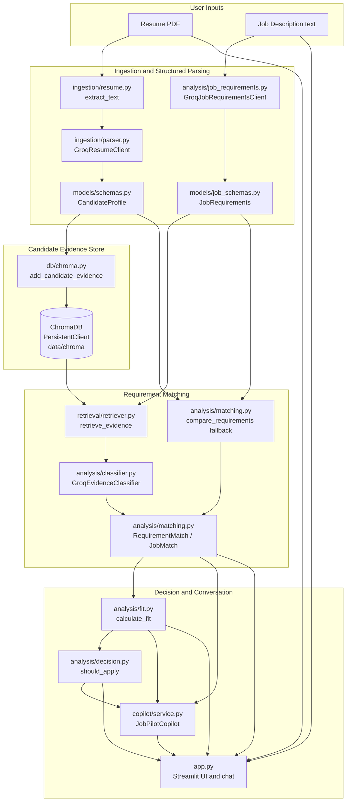

# JobPilot Architecture

JobPilot is an LLM Zoomcamp final project that combines structured extraction,
retrieval-augmented evidence matching, deterministic aggregation, and a
conversation layer. Its purpose is to help a candidate understand one specific
job opportunity using the evidence present in their resume.

## System Overview



The application entry point is `app.py`. It coordinates the Streamlit interaction
and calls the modules above; the domain logic remains in `src/`.

## End-to-End Request Flow

### 1. Resume ingestion

`app.py` receives a PDF through `st.file_uploader()`. It writes the uploaded file
to the local `data/` directory and calls `ingestion.resume.extract_text()`, which
uses `pypdf.PdfReader` to extract page text.

`ingestion/chunker.py` contains deterministic section/token chunking utilities,
but the current Streamlit pipeline passes the extracted text directly to the
structured parser.

### 2. Candidate profile parsing

`ingestion.parser.parse_resume_text()` calls Groq structured JSON output and
validates the result as `CandidateProfile` using the models in
`models/schemas.py`.

The profile keeps evidence as lists of factual points:

- `skills: list[str]`
- `experience[].evidence: list[str]`
- `projects[].evidence: list[str]`

The parser prompt instructs the model to use only resume-supported information.
Pydantic then validates the returned shape.

### 3. Evidence storage

`db/chroma.py` converts profile fields into Chroma documents:

- summary as a summary document;
- each skill as a skill document;
- each experience evidence point as an experience document;
- each project evidence point as a project document;
- education and certification fields as their respective documents.

The default collection is `candidate_evidence` in the persistent local path
`data/chroma`. Metadata includes the evidence type and, for experience/projects,
the associated title, company, or project name.

### 4. Job-description parsing

The user pastes a JD into the Streamlit text area. `analysis/job_requirements.py`
calls Groq structured JSON output and validates `JobRequirements` from
`models/job_schemas.py`.

Each requirement contains:

- the requirement wording;
- a category such as `technical_skill`, `education`, `experience`,
  `competency`, `application`, or `other`;
- explicit importance: `required`, `preferred`, or `unspecified`;
- supporting JD evidence.

`application` and `other` records are retained as job information but are not
evaluated as candidate capability evidence by the retrieval matcher.

### 5. Requirement-specific retrieval

`analysis.matching.compare_requirements_with_retrieval()` loops through every
`JobRequirement`.

For matchable categories (`education`, `technical_skill`, `experience`, and
`competency`), it sends the requirement wording to
`retrieval.retriever.retrieve_evidence()`.

The retriever queries Chroma and returns documents with metadata, distance, and a
derived similarity value. This is the retrieval step in the RAG pipeline: each
JD requirement becomes a query over the candidate's stored resume evidence.

For `application` and `other`, the matcher returns `not_applicable` with an
explanation that the record is job/application information rather than a
candidate capability requirement.

### 6. Evidence classification

`analysis.classifier.classify_requirement()` sends the requirement and retrieved
candidate documents to `GroqEvidenceClassifier`.

The classifier returns structured `EvidenceClassification` data:

- `strong`: the supplied evidence clearly supports the requirement;
- `partial`: the evidence is related or supports only part of the requirement;
- `no_evidence`: the supplied evidence does not establish the requirement.

The classifier is explicitly instructed not to infer equivalence. For example,
Azure AI evidence does not prove Azure Data Lake experience. It also treats
`no_evidence` as lack of support in the supplied resume, not proof that the
candidate lacks the capability.

The result is mapped into `RequirementMatch` and collected in `JobMatch` by
`models/matching.py`.

The same module also contains `compare_requirements()`, a direct deterministic
lexical matcher over `CandidateProfile`. This is a fallback/evaluation path and
does not use ChromaDB.

## Job Fit and Application Decision

`analysis/fit.py` calculates the fit summary from `JobMatch`:

```text
required weight = 2
preferred/unspecified weight = 1
strong points = full weight
partial points = half weight
no_evidence points = zero
not_applicable = excluded
```

The score is rounded from earned points divided by applicable maximum points,
multiplied by 100. The output also includes counts of strong, partial, and
no-evidence matches.

`analysis/decision.py` uses the fit score and missing/partial required matches to
return one of `apply`, `consider`, or `low_fit`.

The score and decision are deterministic summaries of evidence coverage. They are
not hiring-probability predictions, ATS scores, or measures of resume quality.

## Conversational Layer

After analysis, `app.py` stores the fit and serialized matches in Streamlit session
state. `copilot.service.JobPilotCopilot.answer()` receives:

- the user's question;
- the existing analysis;
- recent conversation history.

The copilot does not re-run resume parsing, JD parsing, retrieval, or fit
calculation for every question. Its system prompt requires it to answer from the
existing context and to avoid inventing candidate capabilities or job facts.

The Streamlit UI maintains `chat_history` and supports the suggested questions:

- Should I apply?
- What should I improve?
- What should I learn?

## Evidence and Hallucination Boundary

The source of truth is split by artifact:

- resume text is the source of truth for candidate capabilities;
- JD text is the source of truth for job requirements;
- retrieved Chroma documents are the evidence supplied to the classifier;
- existing analysis is the context supplied to the copilot.

The system intentionally does not infer:

- AWS from Azure;
- PostgreSQL from generic SQL;
- Databricks from Azure;
- React from JavaScript;
- experience from education;
- strong knowledge merely because a technology appears once.

No evidence means that the current source data does not support a claim. It is not
a negative fact about the candidate.

## Local Components

| Component | Responsibility |
| --- | --- |
| `app.py` | Streamlit workflow, session state, dashboard metrics, and chat UI |
| `src/ingestion/resume.py` | PDF text extraction |
| `src/ingestion/parser.py` | Groq resume parsing into `CandidateProfile` |
| `src/analysis/job_requirements.py` | Groq JD requirement extraction |
| `src/db/chroma.py` | Persistent Chroma collection and evidence upsert |
| `src/retrieval/retriever.py` | Requirement-specific Chroma queries |
| `src/analysis/classifier.py` | Groq classification of retrieved evidence |
| `src/analysis/matching.py` | Retrieval matching and lexical fallback |
| `src/analysis/fit.py` | Deterministic fit summary |
| `src/analysis/decision.py` | Deterministic application recommendation |
| `src/copilot/service.py` | Groq conversational answers from existing analysis |
